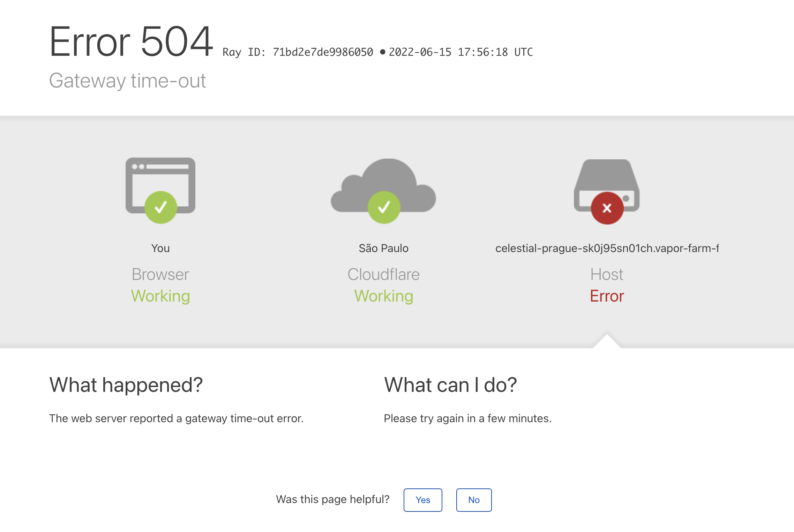
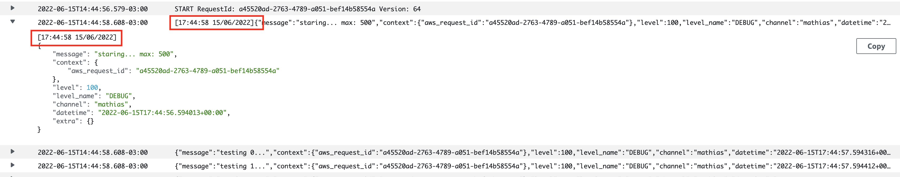
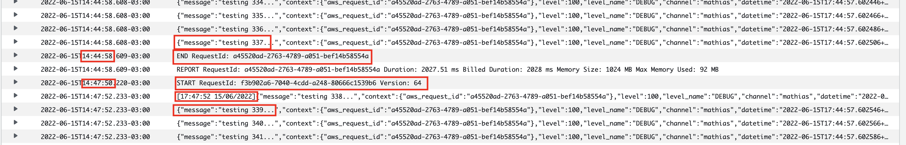
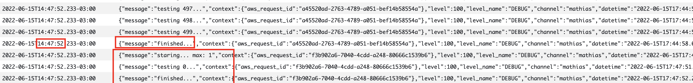
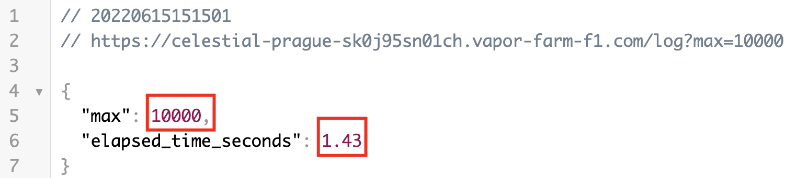

# Laravel Vapor Logging Issues & Solutions

I have been using Laravel Vapor for almost 2 years now and while It's awesome, it also comes
with some things you need to workaround or simple design it differently than you would normally.

In this article, I would like to go through a very specific issues I had with Laravel Vapor, and
maybe be able to help someone else, or get input from other users in order to improve my proposed
solution.

I had migrated one project entirely from conventional servers to Laravel Vapor, and due to 
this very issue that I am going to talk, I had to moved it all back to the conventional servers. 

And I am not talking about moving staging servers. In this specific case we run with Vapor in production 
for about a week fixing things here and there until we hit a blocker issue that we could not solve. 
At the time I also tried Laravel Vapor support, providing real code, videos, etc... but unfortunately they were not
of any help.

## The Issue
Vapor utilizes by default the `stderr` `LOG_CHANNEL`, which outputs all logs to the `php://stderr`.

For some cases it works OK, however, if you are going to log a bit more, it's going to slow down a lot, 
to the point the request will exceed the maximum allowed execution time of 30 seconds and nothing at all
will be logged.

This issue can be observed with a simple iteration from 0 to 1000, which isn't really much at all.

Vapor could get away on a 0-500 iteration, which I used to debug further this issue, and will explain
on the next topic.

```php
// routes/web.php

Route::get('/log', function () {
    for ($i = 0; $i < 1000; $i++) {
        logger("testing {$i}...");
    }
});
```

After 30 seconds you will see this:



And 0 log entries in CloudWatch.

## How Logs Work in Laravel Vapor
To debug this issue, I had to dig into the `vapor-core` source code, more specifically in
`vendor/laravel/vapor-core/src/Runtime/Fpm/Fpm.php` around line `133`. Bellow we can see part of the code:

```php
// vendor/laravel/vapor-core/src/Runtime/Fpm/Fpm.php

public function start()
{
    if ($this->isReady()) {
        $this->killExistingFpm();
    }

    fwrite(STDERR, 'Ensuring ready to start FPM'.PHP_EOL);

    $this->ensureReadyToStart();

    $this->fpm = new Process([
        'php-fpm',
        '--nodaemonize',
        '--force-stderr',
        '--fpm-config',
        self::CONFIG,
    ]);

    fwrite(STDERR, 'Starting FPM Process...'.PHP_EOL);

    $this->fpm->disableOutput()
        ->setTimeout(null)
        ->start(function ($type, $output) {
            // fwrite(STDERR, $output.PHP_EOL); 
            // I replaced the above line with the one bellow
            fwrite(STDERR, "[" . (new \DateTime('now'))->format('H:i:s d/m/Y') ."]" . $output.PHP_EOL);
        });

    $this->ensureFpmHasStarted();
}

```

I prepended a timestamp to the beginning of the log just to see if it would generate multiple entries in CloudWatch
or a single one. 

If it was a single one it meant it was all buffered, and if we could see many entries it would not be
buffered.

To my surprise it was neither.

**Logs are buffered and batched, leading to multiple single entries.**

I updated the `/log` route with the following code so that we could debug it better.
I added some sleeps also so that we would be sure that the full request would not finish in 
less than 1 second and could make debugging harder.

```php
// routes/web.php

Route::get('/log', function () {
    $t0 = microtime(true);

    $max = (int)request('max');

    logger("staring... max: {$max}");
    sleep(1);

    for ($i = 0; $i < $max; $i++) {
        logger("testing {$i}...");
    }
    $t1 = microtime(true);

    sleep(1);
    logger("finished...");

    return [
        'max' => $max,
        'elapsed_time_seconds' => round($t1 - $t0, 2),
    ];
});

```

### CloudWatch

Bellow we can see the first request, for 500 repetitions.
Only the first log entry has the prepended timestamp which means the logs are batched.



Then, strangely, despite being sure the request completed successfully, we can see 
that the logs stop at the 337 iteration.

After about 3 minutes, I fired another request, with `?max=1` which would only iterate
once, and to my surprise, the rest of the logs showed up, along with the single iteration
logs.



We can also see that the log entries itself actually have the timestamp from the previous request, `17:44:57`



This means that logs are definitely batched and also buffered, and in some cases
the buffer is flushed only upon a new request.

I am particularly interested in logs and like to log a lot and this behaviour is just too bad
to me.

## Other Log Drives
I tried other log drives like `papertrail` which uses `UDP` and in all fairness I actually
tried pretty much all options available in the `config/logging.php` file.

None of the options really worked well. 

One option that worked a bit better was `papertrail` but still it failed at some point.
I think I was able to log about 5000 entries with it before it timed out. 

Still too bad to me.

On my local environment the default `single` logging driver writes 100.000 entries in less
than 10 seconds.

## A Test That Worked
To test a proof of concept on fixing this issue I decided to log everything to the local disk,
which in Vapor is a bad idea as it will get lost, considering Vapor doesn't 
guarantee to keep anything from one request to another.

I've added the following logging channel to my `config/logging.php`

```php
// config/logging.php

'vapor' => [
    'driver' => 'daily',
    'path' => '/tmp/laravel.log',
    'level' => env('LOG_LEVEL', 'debug'),
    'days' => 14,
],
```

and updated my Laravel Vapor environment to use this new logging channel:

```php
LOG_CHANNEL=vapor
````

After this I fired a few request to `/log` with different `?max` to see how it would perform.
All request I made worked, from 1 to 100000, and very fast also, like on my local environment.



## My Current Solution
Currently, I am working around this issue pretty much in the way I described above, with
the exception that I am using a mounted EFS storage.

You can find more info about how to attach an EFS storage to your environment in the Vapor
documentation.

To be able to do that you would need to create a network in Vapor and make sure 
that both your environment and the EFS disk are using that network.

```php
// config/logging.php

'vapor' => [
    'driver' => 'daily',
    'path' => '/mnt/efs/my_app_my_environment/logs/laravel.log',
    'level' => env('LOG_LEVEL', 'debug'),
    'days' => 14,
],
```

By doing that it works pretty well, however logs are not present in CloudWatch anymore,
nor they are available in Vapor UI. 

### Visualizing The Logs
The way I use to check the logs is a bit rudimentary, but in all fairness, I actually like
it and it also gives me some possibilities that are not present in other solutions.

In Laravel Vapor you can have a Jumpbox, which is an EC2 instance with access to that network
you created. You could also use another EC2 instance or some other way to achieve what I am 
going to explain.

In the Jumpbox I simply mount the EFS disk and tail/grep/vim/scp the logs as I need.

To auto mount the EFS disk you need to create a mount point like `/mnt/efs`
and 
```bash
sudo vim /etc/fstab
```

```bash
# /etc/fstab
fs-your-filesystem-id /mnt/efs efs _netdev,noresvport,tls,accesspoint=fsap-your-access-point 0 0
```

## Additional Benefits
In addition to being able to log properly, we can also log from the Scheduler, something
that the Vapor documentation says is not possible using the default logging channel.

## Further Improvements
If we wanted, we could have this Jumpbox, or another EC2 instance, forwarding these logs to
anywhere we wanted, including CloudWatch. We could send the logs to an ELK stack
or anything really.


## Thanks
Thanks for checking out this article. If you have questions/suggestions you can [reach me
on Twitter](https://twitter.com/matgrimm) or shoot me an email on mathiasgrimm@gmail.com


*by Mathias Grimm @ 15/06/2022 (https://twitter.com/matgrimm)*
